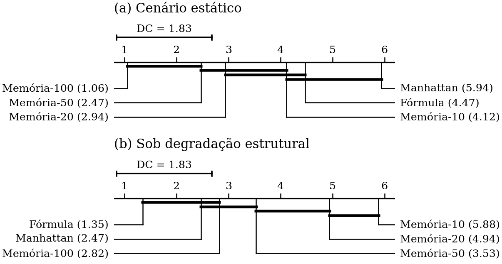

# Síntese automática de heurísticas para busca de caminhos em videogames

**Uma heurística descoberta por algoritmo genético perde feio para heurísticas de memória em
mapas estáticos — e ganha de todas elas assim que o mapa começa a mudar.**

Este repositório contém o experimento completo que mede essa inversão: código, dados,
análise estatística e a documentação de como cada número foi obtido.

<sub>Iniciação científica PIBIC/PAIC 2025–2026 · UFAM / Instituto de Computação ·
Projeto PIB-E/0151/2025 · Financiamento CNPq ·
Orientação: Dra. Rosiane de Freitas Rodrigues</sub>

---

## O problema

O A\* é o algoritmo de busca de caminhos que roda por baixo de praticamente todo jogo com
movimentação em grade. Seu desempenho depende inteiramente da heurística que estima a distância
até o destino, e há um trade-off clássico entre duas famílias:

- **Manhattan** é gratuita, mas ingênua — ignora completamente a geometria do mapa.
- **Heurísticas de memória** pré-computam distâncias exatas a partir de pontos de referência
  (*pivôs*) e são muito mais precisas — ao custo de memória e de um pré-processamento pesado.

Só que jogos têm mapas que **mudam**: portas que fecham, pontes que caem, construções que
aparecem. Distâncias pré-computadas envelhecem. E aí entra a terceira opção: e se, em vez de
memorizar distâncias, o sistema **descobrisse sozinho uma fórmula** adaptada à geometria daquele
mapa?

> **A pergunta:** uma heurística sintetizada por programação genética compete com as clássicas —
> não só em velocidade, mas em **robustez a mudanças no mapa**?

## A abordagem

Três classes de heurística, comparadas no algoritmo A\* sobre **17 mapas de *Dragon Age:
Origins*** (Moving AI Lab), em grades 4-conectadas:

| | Como funciona | Pré-proc. | Memória | Admissível |
|---|---|---|---|---|
| **Manhattan** | `\|Δx\| + \|Δy\|` | — | zero | ✅ |
| **Memória (pivôs)** | `maxᵢ \|d(pᵢ,s) − d(pᵢ,g)\|`, distâncias exatas por BFS de pivôs escolhidos por *Farthest-First* | uma BFS por pivô | até 109 MB | ✅ |
| **Fórmula (AG)** | expressão simbólica evoluída como árvore sintática sobre `deltaX`/`deltaY` | a síntese | só a árvore | ❌ |

A fórmula é evoluída por **algoritmo genético sobre ASTs** (população 80, 100 gerações,
elitismo 10%), maximizando a redução de expansões contra a Manhattan. Uma fórmula por mapa.
Exemplo de campeã, em notação prefixa: `(+ (sqr deltaY) (sqr deltaX))`.

Depois de medir no mapa original, cada mapa é progressivamente bloqueado em **10%, 20% e 30%**
das células transitáveis, segundo **cinco padrões de degradação estrutural**:

| Linear | Orgânico | Radial | Esparso | Estocástico |
|---|---|---|---|---|
| barreiras retas que seccionam o mapa | passeios aleatórios, como escombros | discos, como crateras | discos porosos | células soltas por toda parte |

**Escala do experimento:** 6 configurações × 116.700 instâncias origem–destino, em desenho
pareado — todas as heurísticas resolvem exatamente os mesmos problemas. Cerca de **1,25 milhão
de medições**, ~20 h de execução.

## Os resultados

### 1. A hierarquia se inverte

Ranking por teste de Friedman com pós-teste de Nemenyi (diagrama de diferença crítica, DC = 1,83:
métodos ligados pela barra são estatisticamente indistinguíveis):



No **mapa estático**, a memória com 100 pivôs é a melhor em quase todos os mapas (posto médio
1,06 de 6) e a fórmula é a penúltima (4,47). **Sob degradação, a ordem se inverte**: a fórmula
passa a **1,35** e a memória-100 cai para 2,82 — e a memória com 10 pivôs vira a **pior de
todas** (5,88), atrás até da Manhattan.

O δ de Cliff da comparação Manhattan × Memória-100 vira de sinal: **+0,917 → −0,813**.
A interação estratégia × padrão de degradação é forte e significativa
(**η²ₚ = 0,241**; teste de permutação: F observado é **82× o máximo de 200 nulos**, p ≤ 0,005).

### 2. A fórmula é a mais robusta nos 5 de 5 padrões

Fator de degradação δ = expansões no mapa degradado ÷ expansões no original (menor é melhor):

| Padrão | Manhattan | **Fórmula** | Mem-10 | Mem-20 | Mem-50 | Mem-100 |
|---|---|---|---|---|---|---|
| Linear | 1,16 | **1,14** | 3,12 | 3,09 | 2,66 | 2,28 |
| Orgânico | 1,26 | **1,14** | 3,51 | 2,45 | 1,51 | 1,26 |
| Radial | 1,13 | **1,11** | 2,25 | 1,67 | 1,17 | 1,11 |
| Esparso | 1,37 | **1,19** | 3,10 | 2,05 | 1,38 | 1,26 |
| Estocástico | 2,47 | **1,84** | 3,11 | 2,78 | 2,08 | 1,93 |

E há uma reviravolta que reforça o achado: **a heurística de memória recebe, de graça, um
recálculo completo de todas as suas distâncias a cada degradação** — 93,4% delas mudam. A fórmula
não recebe nada, e mesmo assim degrada menos. O número acima é, portanto, um limite *superior*
generoso para a memória.

### 3. O preço da precisão

| | Expansões (÷ Dijkstra) | Memória | Preparação | Subotimalidade |
|---|---|---|---|---|
| Manhattan | 0,209 | 0 | 0 | ótimo |
| **Fórmula** | 0,075 | 0 | 543 s (síntese) | **+11,2%** |
| Memória-10 | 0,048 | 4,9 MB | 12 ms | ótimo |
| Memória-100 | **0,025** | 49 MB | 103 ms | ótimo |

A síntese da fórmula custa de **777× a 12.197×** o tempo de pré-computar 100 pivôs. Ela compra
robustez e memória zero, e paga com tempo de preparação e com caminhos subótimos: apenas
**18,5% dos caminhos são ótimos**, e **44,9% excedem 1,10×** o comprimento ideal.

Um resultado contra-intuitivo: a fórmula viola admissibilidade em **99,9%** dos pares — e isso
**não prevê** a subotimalidade observada (Spearman ≈ −0,003). Superestimar a distância quase
sempre não implica encontrar caminhos ruins na prática.

## Rigor: o trabalho foi auditado contra si mesmo

A primeira versão do relatório reportava apenas média ± desvio-padrão sobre 5 sementes. Uma
reanálise estatística completa foi então conduzida sobre os **dados brutos originais**, com
13 análises independentes (A0–A12), 34 tabelas e testes de hipótese com tamanho de efeito.

Ela **contradisse o próprio relatório em quatro pontos** — e todos estão documentados aqui:

| O que o texto afirmava | O que a medição mostrou |
|---|---|
| *Speedup* de **51,98×** da memória sobre a Manhattan | **7,87×** [IC 95%: 4,92–9,39]. O número antigo comparava a memória medida em 23.906 instâncias com a Manhattan medida em 116.700 — **duas populações diferentes**. Erro de 6,6×. |
| As heurísticas **não são reprocessadas** sob degradação | O código recalcula todas as distâncias dos pivôs; **93,4%** delas mudam. Só as *posições* ficam congeladas. |
| O desvio-padrão anômalo de 138,44 é "instabilidade do sorteio" | É um **colapso geométrico previsível**: quando o primeiro pivô cai num bolsão desconexo, todos os pivôs ficam presos e `h ≡ 0`. Previstos 7 casos, observados os mesmos 7. |
| A regularização por tamanho controla a complexidade das fórmulas | É **inerte**: a penalidade vale ≤ 1,6% da aptidão, e o tamanho da árvore chega a *aumentar* a aptidão. |

A correção metodológica central: razões agregam por **média geométrica**, expansões são
**normalizadas por mapa**, e a unidade de replicação para generalizar é o **mapa (n = 17)**, não
a instância (n = 116.050). Uma verificação que só a média geométrica satisfaz —
`2,799 × 2,811 = 7,866`, exatamente a razão medida em separado — está descrita em
[`docs/03-achados-estatisticos.md`](docs/03-achados-estatisticos.md).

O que **não** se pode afirmar com estes dados está registrado com o mesmo cuidado, em
[`docs/04-problemas-conhecidos.md`](docs/04-problemas-conhecidos.md).

## Como está organizado

```
codigo/
  run-referencia-2026-03/   ⭐ C++ que gerou todos os dados publicados
  refatoracao-2026-06/         reescrita posterior ao relatório
  medicoes-2026-08/            programas auxiliares da reanálise
analise/
  original-2026-03/            análise da primeira versão do texto
  estatistica-2026-08/         reanálise completa: 13 scripts, 34 tabelas, 2 figuras
maps/                          os 17 mapas + cenários (Moving AI Lab)
docs/                          documentação; historico/ preserva os originais sem edição
relatorio/                     o relatório final, em PDF
```

O repositório guarda **três versões do código C++**, de fases diferentes do projeto. Apenas a de
março de 2026 produziu os resultados publicados — as outras têm esquema de CSV incompatível.
[`docs/00-PROVENIENCIA.md`](docs/00-PROVENIENCIA.md) explica qual é qual, e por quê.

## Como rodar

```fish
make ajuda          # lista os alvos
make referencia     # compila o experimento -> bin/pathfinding-referencia
make testes         # testes unitários
```

Reproduzir a análise estatística inteira leva **~3 minutos** e regenera as 34 tabelas byte a
byte. Os dados brutos (~170 MB) ficam fora do Git — ver
[`dados/MANIFESTO.md`](dados/MANIFESTO.md) para onde estão e como conferir a integridade:

```fish
cd analise/estatistica-2026-08
python3 -m venv .venv; and .venv/bin/pip install -r requirements.txt
set -x HEURISTICAS_DADOS <pasta com os CSVs brutos>
.venv/bin/python scripts/run_all.py
```

## Documentação

| | |
|---|---|
| [00-PROVENIENCIA](docs/00-PROVENIENCIA.md) | que código gerou que dado, e por que isso importa |
| [01-experimento](docs/01-experimento.md) | o que foi medido e como |
| [02-arquitetura-do-codigo](docs/02-arquitetura-do-codigo.md) | o código módulo a módulo |
| [03-achados-estatisticos](docs/03-achados-estatisticos.md) | os resultados da reanálise, análise por análise |
| [04-problemas-conhecidos](docs/04-problemas-conhecidos.md) | bugs e limitações, com o impacto de cada um |
| [05-como-reproduzir](docs/05-como-reproduzir.md) | comandos exatos |
| [dados/MANIFESTO](dados/MANIFESTO.md) | esquema dos dados e onde eles estão |

📄 **[Relatório final (PDF)](relatorio/RelatorioFinal_PIBIC_2025-2026_AlexandrePereiraSouzaJunior.pdf)**

📝 **[Artigo aceito — WPerformance (CSBC 2026)](https://sol.sbc.org.br/index.php/wperformance/article/view/43174)**

<details>
<summary><b>English summary</b></summary>

**Automatic synthesis of heuristics for video game pathfinding.** An empirical comparison of
three heuristic families for A\* on 17 *Dragon Age: Origins* grid maps (Moving AI Lab):
Manhattan, memory-based differential heuristics with 10–100 farthest-first pivots, and symbolic
formulas synthesized by genetic programming over ASTs. Maps are progressively blocked at 10%,
20% and 30% under five structural degradation patterns.

**Main finding — a hierarchy inversion.** On static maps, memory-based heuristics with 100 pivots
rank first (mean rank 1.06/6) and the synthesized formula ranks fifth (4.47). Under structural
degradation the order reverses: the formula ranks first (1.35) while 10-pivot memory becomes the
worst (5.88). Strategy × pattern interaction: η²ₚ = 0.241, p ≤ 0.005 by permutation. The formula
is the least degraded under all five patterns — despite being the only strategy that receives no
recomputation.

**Methodological note.** A full statistical reanalysis of the raw data contradicted the original
report on four points, most notably a headline speedup inflated 6.6× by comparing two different
instance populations (51.98× → 7.87×, 95% CI [4.92, 9.39]). Corrections, effect sizes and the
limits of what the data can support are documented in `docs/`.
</details>

---

## Créditos

**Autor:** Alexandre Pereira de Souza Junior — UFAM/IComp
**Orientação:** Dra. Rosiane de Freitas Rodrigues
**Fomento:** CNPq, projeto PIB-E/0151/2025

O subsistema de programação genética em `src/synthesis/` é uma tradução de MATLAB para C++ do
código de **Saunders (2024)**, feita com assistência de IA; os cabeçalhos dos arquivos registram
isso individualmente. Mapas e cenários vêm do
[Moving AI Lab](https://movingai.com/benchmarks/), conjunto *Dragon Age: Origins*.
