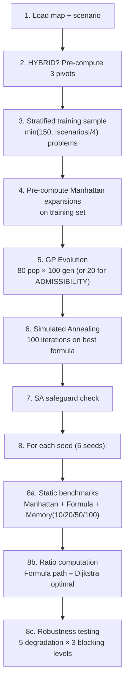

# Heurística — Complete Technical Context

> Self-contained reference for the GP-based heuristic synthesis and comparison system for A\* pathfinding on game grid maps.

---

## Table of Contents

1. [Research Context](#1-research-context)
2. [Project Structure](#2-project-structure)
3. [Build System](#3-build-system)
4. [Data Formats](#4-data-formats)
5. [Module Reference: Grid Map System](#5-module-reference-grid-map-system)
6. [Module Reference: Heuristic Functions](#6-module-reference-heuristic-functions)
7. [Module Reference: A\* Search](#7-module-reference-a-search)
8. [Module Reference: AST (HeuristicNode)](#8-module-reference-ast-heuristicnode)
9. [Module Reference: Grammar (Random Tree Generation)](#9-module-reference-grammar-random-tree-generation)
10. [Module Reference: Genetic Operators](#10-module-reference-genetic-operators)
11. [Module Reference: Genetic Algorithm](#11-module-reference-genetic-algorithm)
12. [Module Reference: Simulated Annealing](#12-module-reference-simulated-annealing)
13. [Module Reference: Experiment Driver (main.cpp)](#13-module-reference-experiment-driver)
14. [Synthesis Modes](#14-synthesis-modes)
15. [Fitness Function](#15-fitness-function)
16. [Map Degradation Patterns](#16-map-degradation-patterns)
17. [Experiment Methodology](#17-experiment-methodology)
18. [Output CSV Schemas](#18-output-csv-schemas)
19. [Python Analysis Pipeline](#19-python-analysis-pipeline)
20. [Saunders Comparison Infrastructure](#20-saunders-comparison-infrastructure)
21. [Key Design Decisions and Trade-offs](#21-key-design-decisions-and-trade-offs)

---

## 1. Research Context

This project is a **PIBIC undergraduate research** comparing three families of heuristics for the A\* pathfinding algorithm on grid maps from the game Dragon Age Origins (Moving AI Lab benchmarks):

| Heuristic Family | Mechanism | Memory Cost | Admissible? |
|---|---|---|---|
| **Manhattan** | `\|Δx\| + \|Δy\|` | Zero | Always |
| **Formula (GP)** | AST tree evolved by Genetic Programming | Zero (just the formula tree) | Depends on synthesis mode |
| **Memory-based (Differential)** | `max(\|d(pivot,s) - d(pivot,g)\|)` over precomputed BFS distances | `O(pivots × vertices × 4 bytes)` | Always |

The GP synthesis engine was **translated from Saunders (2024) MATLAB/Octave code** into C++17. The original Saunders code lives in `fsynth-tarball/fsynth/` and is invoked via GNU Octave as a comparison baseline.

### The Core Hypothesis

A GP-evolved formula can achieve comparable node-expansion reduction to memory-based heuristics **without any memory overhead**, and can remain robust under dynamic map modifications (obstacle degradation).

---

## 2. Project Structure

```
heuristicas/                          ← Main project root
├── Makefile                          ← Build system
├── pathfinding                       ← Compiled binary (178KB)
├── src/
│   ├── Config.h                      ← Mode enum (6 lines)
│   ├── map.h / map.cpp               ← Grid loading + 5 degradation patterns
│   ├── heuristics.h / heuristics.cpp ← All heuristic functions + pivot system
│   ├── astar.h / astar.cpp           ← A* search implementation
│   ├── main.cpp                      ← Experiment driver (455 lines)
│   └── synthesis/
│       ├── HeuristicNode.h           ← AST node hierarchy (376 lines)
│       ├── HeuristicGrammar.h/.cpp   ← Random formula tree generation
│       ├── GeneticOperators.h/.cpp   ← Crossover + mutation
│       ├── GeneticAlgorithm.h/.cpp   ← Evolution loop (OpenMP parallel)
│       └── SimulatedAnnealing.h/.cpp ← Post-GP local search
├── maps/                             ← 17 Dragon Age .map + .scen files
├── WPerformance/                     ← Python analysis & visualization
│   ├── analise.py                    ← Master analysis (11 blocks of tables)
│   ├── gerar_figuras.py              ← Publication-ready figures
│   ├── gerarGraficos.py              ← Degradation figure (corrected methodology)
│   ├── gerar_graficos_sbc.py         ← SBC/IEEE conference figures
│   ├── gerar_pareto.py               ← Pareto frontier (memory vs performance)
│   ├── comparar_implementacoes.py    ← C++ vs Saunders Octave comparison
│   ├── rodar_saunders.py             ← Octave bridge script
│   ├── visualize_degradations.py     ← PPM visualization of degradation patterns
│   └── results.db                    ← SQLite database (89MB)
├── resultados_base.csv               ← Per-problem benchmark results
├── resultados_robustez.csv           ← Robustness test results
├── resultados_ratio.csv              ← Sub-optimality ratio results
├── resultados_sintese.csv            ← Synthesis metadata
└── resultados_sintese_saunders.csv   ← Saunders baseline (header-only)
```

---

## 3. Build System

**Compiler**: `g++` with C++17  
**Optimization flags**: `-O3 -march=native -ffast-math`  
**Parallelism**: OpenMP (`-fopenmp`) for parallel fitness evaluation in the GA

```makefile
CXX = g++
CXXFLAGS = -O3 -march=native -ffast-math -fopenmp -std=c++17

pathfinding: src/main.cpp src/map.cpp src/heuristics.cpp src/astar.cpp \
             src/synthesis/HeuristicGrammar.cpp \
             src/synthesis/GeneticOperators.cpp \
             src/synthesis/GeneticAlgorithm.cpp \
             src/synthesis/SimulatedAnnealing.cpp
	$(CXX) $(CXXFLAGS) -o pathfinding $^
```

**Make targets:**

| Target | Command | Purpose |
|---|---|---|
| `make` | Compile `pathfinding` binary | Build the C++ engine |
| `make saunders` | `python3 WPerformance/rodar_saunders.py` | Run Saunders baseline via Octave |
| `make compare` | `python3 WPerformance/comparar_implementacoes.py` | Compare C++ vs Saunders results |
| `make all-modes` | Run `./pathfinding --mode {absolute,delta,admissibility,hybrid}` | Execute all 4 synthesis modes |
| `make clean` | Remove binary | Clean build artifacts |

**Runtime**: `./pathfinding --mode <mode>` where mode ∈ {`absolute`, `delta`, `admissibility`, `hybrid`}

---

## 4. Data Formats

### 4.1 Map Format (HOG/Moving AI)

Files: `maps/*.map`

```
type octile
height <H>
width <W>
map
<H lines of W characters>
```

Characters: `.` = traversable, `@`/`T` = blocked, other = blocked.

**Movement**: 4-directional only (up, down, left, right), cost = 1 per step.

### 4.2 Scenario Format

Files: `maps/*.map.scen`

```
version 1
<bucket> <map_path> <width> <height> <startX> <startY> <goalX> <goalY> <optimalDist>
...
```

> [!IMPORTANT]
> Coordinates are swapped when loaded: the code reads `(sX, sY, gX, gY)` from the file but stores them as `{sY, sX}` and `{gY, gX}` — i.e., `{row, col}` internally.

---

## 5. Module Reference: Grid Map System

**Files**: [map.h](file:///home/alejr/Documentos/heuristica/heuristicas/src/map.h) / [map.cpp](file:///home/alejr/Documentos/heuristica/heuristicas/src/map.cpp)

### Global State

```cpp
int height, width;                    // Map dimensions
vector<vector<bool>> grid;            // Traversability grid (true = walkable)
int originalTraversableCells;         // Count of walkable cells before degradation
int px[4] = {0, 0, 1, -1};           // Row offsets for 4-directional neighbors
int py[4] = {-1, 1, 0, 0};           // Col offsets for 4-directional neighbors
```

### Functions

#### `loadMap(filename)`
Parses the HOG `.map` format. Sets `height`, `width`, `grid`, and counts `originalTraversableCells`.

#### `verificaPontosConectados(start, goal) → bool`
BFS connectivity check between two points. Uses a flat `vector<bool>` visited array (`row * width + col` indexing). Returns `true` if goal is reachable from start through traversable cells.

#### `getDynamicSize() → int`
Utility: `max(2, min(height, width) / 20)`. Used as default radius for radial/sparse degradation.

### Degradation Functions

Each degradation pattern follows the same driver pattern:
1. A **primitive** function places one obstacle cluster, returns how many cells it blocked
2. A **driver** function repeatedly calls the primitive until `targetBlocked` cells are blocked (or a safety limit is hit)

| Pattern | Primitive | Driver | Algorithm |
|---|---|---|---|
| **Radial** | `radialObstacle(raio, aspecto)` | `degradaMapa(targetBlocked)` | Elliptical patches centered at random traversable cell. Blocks all cells within ellipse radius. |
| **Linear** | `linearObstacle(length)` | `degradaMapaLinear(targetBlocked)` | Wall segments: picks random cell + random cardinal direction, blocks `length` consecutive cells. `length = max(10, min(H,W)/2)`. |
| **Sparse** | `sparseObstacle(raio, density)` | `degradaMapaSparse(targetBlocked)` | Circular region where each cell is blocked with probability `density=0.4`. `raio = max(5, min(H,W)/10)`. |
| **Organic** | `organicObstacle(numCells)` | `degradaMapaOrganic(targetBlocked)` | Random walk from a start point, blocks cells along the walk path. `numCells = max(20, H*W/250)`. Max iterations = `numCells * 5`. Walk resets to origin if it leaves the map. |
| **Stochastic** | (inline) | `degradaMapaSaunders(targetBlocked)` | Pure random: picks random cell, blocks it if traversable. Saunders' original method. Safety limit = `H * W * 10`. |

> [!NOTE]
> Degradation is **cumulative** in the experiment: the driver applies 10% → 20% → 30% incrementally on the same grid, saving snapshots at each level.

---

## 6. Module Reference: Heuristic Functions

**Files**: [heuristics.h](file:///home/alejr/Documentos/heuristica/heuristicas/src/heuristics.h) / [heuristics.cpp](file:///home/alejr/Documentos/heuristica/heuristicas/src/heuristics.cpp)

### Global State

```cpp
vector<pair<int,int>> pivos;                // Pivot coordinates
vector<vector<vector<int>>> distPivos;      // distPivos[pivotIdx][row][col] = BFS distance
shared_ptr<HeuristicNode> currentFormula;   // Active synthesized formula (AST)
```

### Heuristic Functions

All heuristics share the signature `int h(pair<int,int> s, pair<int,int> goal)`.

#### `heuristicaManhattan(start, goal)`
```
return |start.row - goal.row| + |start.col - goal.col|
```

#### `heuristicaMemoryBased(s, goal)`
Differential heuristic using the **triangle inequality**:
```
return max over all pivots p: |d(p, s) - d(p, goal)|
```
Where `d(p, x) = distPivos[p][x.row][x.col]` (precomputed BFS). Skips pivots where either point is unreachable (`d = -1`).

#### `heuristicaFormula(s, goal)`
Evaluates the `currentFormula` AST with `Point{s.row, s.col}` and `Point{goal.row, goal.col}`. **Fallback** if `currentFormula` is null: `75 * max(dx, dy)`.

#### `heuristicaZero(s, goal)`
Returns `0`. Used as Dijkstra (for computing optimal path costs).

### Pivot System

#### `generatePivots(n) → vector<pair<int,int>>`
**Farthest-First Traversal (Max-Min)** algorithm:
1. First pivot: random traversable cell
2. BFS from first pivot → `minDists[i][j]` = distance to nearest pivot
3. For each subsequent pivot:
   - Find the traversable cell with the **maximum** value in `minDists` (farthest from all current pivots)
   - BFS from this new pivot
   - Update `minDists[i][j] = min(minDists[i][j], newDist[i][j])`
4. Fallback: if no valid candidate (disconnected component), pick random traversable cell

#### `bfsPivo(pivo) → vector<vector<int>>`
Standard BFS from a single pivot to all reachable cells. Returns a `height × width` distance grid (`-1` = unreachable).

#### `computarDistPivos(n)`
Generates `n` pivots via Farthest-First, then BFS from each pivot. Stores results in `pivos` and `distPivos`.

#### `computarDistPivosFixos(pivosFixos)`
Same as above but uses pre-selected pivot coordinates (for robustness tests — reuses pivots from the original undegraded map on degraded maps).

---

## 7. Module Reference: A\* Search

**Files**: [astar.h](file:///home/alejr/Documentos/heuristica/heuristicas/src/astar.h) / [astar.cpp](file:///home/alejr/Documentos/heuristica/heuristicas/src/astar.cpp)

### Data Structures

```cpp
struct tipoNo {
    pair<int,int> coord;   // (row, col) position
    pair<int,int> pai;     // parent position
    int g;                 // cost so far
};

struct SearchResult {
    vector<pair<int,int>> path;  // Full path from start to goal
    int expansions;              // Number of nodes expanded
};
```

### Tie-Breaking (Saunders-style)

```cpp
struct comparadorTipoNo {
    bool operator()(const pair<int, tipoNo>& a, const pair<int, tipoNo> b) {
        if (a.first == b.first)
            return a.second.g < b.second.g;  // When f is equal, prefer HIGHER g
        return a.first > b.first;             // Otherwise, prefer LOWER f
    }
};
```

> [!IMPORTANT]
> When two nodes have equal f-values, the one with **higher g** (closer to goal, deeper in the search) is expanded first. This is the Saunders tie-breaking strategy — it biases A\* toward depth-first behavior among equally-scored nodes.

### `aStar(start, goal, h_func) → SearchResult`

**Algorithm**:
1. Priority queue (`aberta`) ordered by `(f, tipoNo)` with custom comparator
2. Closed set: `vector<vector<bool>> fechado`
3. Best-g tracking: `vector<vector<int>> melhorG` (initialized to `INT_MAX`)
4. **Lazy deletion**: when popping a node, skip it if `atual.g != melhorG[atual.coord]`
5. 4-directional expansion with uniform cost = 1
6. Path reconstruction via `pai` (parent) grid, reversed at the end

**Returns**: Path as vector of `(row, col)` pairs + expansion count. Empty path if no solution.

---

## 8. Module Reference: AST (HeuristicNode)

**File**: [HeuristicNode.h](file:///home/alejr/Documentos/heuristica/heuristicas/src/synthesis/HeuristicNode.h) (376 lines, header-only)

### Class Hierarchy

```
HeuristicNode (abstract base)
├── TerminalNode (leaf node)
├── UnaryNode (1 child)
└── BinaryNode (2 children)
```

All nodes implement:
- `evaluate(Point s, Point g) → double` — Compute the heuristic value
- `toString() → string` — S-expression format: `(op left right)`
- `clone() → shared_ptr<HeuristicNode>` — Deep copy
- `getNode(index, &currentIndex) → shared_ptr` — Pre-order traversal access by index
- `replaceNode(index, newNode, &currentIndex) → bool` — In-place subtree replacement
- Cached `_cachedSize` and `_cachedDepth` (updated on construction and replacement)

### Terminal Types

| Type | `evaluate()` returns | String |
|---|---|---|
| `DELTAX` | `\|s.x - g.x\|` | `"deltaX"` |
| `DELTAY` | `\|s.y - g.y\|` | `"deltaY"` |
| `X1` | `s.x` | `"x1"` |
| `Y1` | `s.y` | `"y1"` |
| `X2` | `g.x` | `"x2"` |
| `Y2` | `g.y` | `"y2"` |
| `CONSTANT` | `constantValue` (1.0–10.0, 1 decimal) | `"3.7"` |
| `PIVOT_DIST_S` | `distPivos[pivotIndex][s.x][s.y]` | `"d(p0,s)"` |
| `PIVOT_DIST_G` | `distPivos[pivotIndex][g.x][g.y]` | `"d(p1,g)"` |

> [!NOTE]
> `PIVOT_DIST_S/G` terminals access the **global** `distPivos` array directly. Bounds-checked at evaluation time — returns `0.0` if out of bounds.

### Unary Operations

| Type | `evaluate()` | String |
|---|---|---|
| `SQRT` | `√\|val\|` (safe: absolute value before sqrt) | `"(sqrt child)"` |
| `ABS` | `\|val\|` | `"(abs child)"` |
| `NEG` | `-val` | `"(neg child)"` |
| `SQR` | `val²` | `"(sqr child)"` |

### Binary Operations

| Type | `evaluate()` | String |
|---|---|---|
| `ADD` | `l + r` | `"(+ l r)"` |
| `SUB` | `l - r` | `"(- l r)"` |
| `MUL` | `l × r` | `"(* l r)"` |
| `DIV` | `l / r` (protected: returns `0.0` if `r = 0`) | `"(/ l r)"` |
| `MAX` | `max(l, r)` | `"(max l r)"` |
| `MIN` | `min(l, r)` | `"(min l r)"` |

### Tree Navigation

Both `getNode` and `replaceNode` use **pre-order traversal** (root → left → right). The `currentIndex` is passed by reference and incremented as the traversal progresses.

- `getNode(targetIndex, &counter)`: Returns the node at position `targetIndex` in pre-order, or `nullptr` if not found in this subtree.
- `replaceNode(targetIndex, newNode, &counter)`: Replaces the child at position `targetIndex`. The parent performs the replacement (a terminal cannot replace itself). Returns `true` on success.

---

## 9. Module Reference: Grammar (Random Tree Generation)

**Files**: [HeuristicGrammar.h](file:///home/alejr/Documentos/heuristica/heuristicas/src/synthesis/HeuristicGrammar.h) / [HeuristicGrammar.cpp](file:///home/alejr/Documentos/heuristica/heuristicas/src/synthesis/HeuristicGrammar.cpp)

### Constructor

```cpp
HeuristicGrammar(Mode m, unsigned int seed);
```
Stores the synthesis mode and seeds the Mersenne Twister RNG.

### `generateRandomHCT(size) → shared_ptr<HeuristicNode>`

Recursive **grow-method** tree builder:

| `size` | Action |
|---|---|
| `≤ 1` | Terminal: 20% chance of `CONSTANT`, 80% chance of mode-dependent terminal. Pivot terminals get random `pivotIndex ∈ [0, 2]`. |
| `= 2` | Unary node + terminal child |
| `≥ 3` | 50/50: either Unary(child of size-1) or Binary(left of random split, right of remainder) |

### Terminal Selection by Mode

```cpp
// ABSOLUTE mode → {X1, Y1, X2, Y2} (raw coordinates)
// DELTA/ADMISSIBILITY/HYBRID → {DELTAX, DELTAY} (relative distances)
```

> [!IMPORTANT]
> In HYBRID mode, the grammar only generates `DELTAX`/`DELTAY` terminals — the `PIVOT_DIST_S/G` terminals are **not automatically injected** by the grammar. They would need explicit handling to appear in initial random trees. Currently HYBRID mode relies on mutation/crossover to potentially introduce them if they existed in the population, but the initial population only gets `DELTAX/DELTAY`. This is a known limitation.

### Random Primitives

- **Unary types**: Uniform over `{SQRT, ABS, NEG, SQR}` (4 types)
- **Binary types**: Uniform over `{ADD, SUB, MUL, DIV, MAX, MIN}` (6 types)
- **Constants**: Uniform in `[1.0, 10.0]`, rounded to 1 decimal place

---

## 10. Module Reference: Genetic Operators

**Files**: [GeneticOperators.h](file:///home/alejr/Documentos/heuristica/heuristicas/src/synthesis/GeneticOperators.h) / [GeneticOperators.cpp](file:///home/alejr/Documentos/heuristica/heuristicas/src/synthesis/GeneticOperators.cpp)

### `mutate(individual) → shared_ptr<HeuristicNode>`

1. Clone the tree
2. Pick a random node index in `[1, size-1]` (never the root)
3. Generate a new random subtree of size `[1, 5]`
4. Replace the selected node with the new subtree via `replaceNode()`
5. If `replaceNode` fails (e.g., tree has size 1), return the new subtree itself

### `crossover(parent1, parent2) → shared_ptr<HeuristicNode>`

1. Clone `parent1` → `offspring`
2. Pick random index `target1` from offspring, `target2` from `parent2`
3. Extract and clone the subtree at `target2` from `parent2`
4. If `target1 == 0` (root), return the extracted branch (whole-tree replacement)
5. Otherwise, graft the branch into offspring at position `target1`
6. If grafting fails, return a clone of `parent2`

---

## 11. Module Reference: Genetic Algorithm

**Files**: [GeneticAlgorithm.h](file:///home/alejr/Documentos/heuristica/heuristicas/src/synthesis/GeneticAlgorithm.h) / [GeneticAlgorithm.cpp](file:///home/alejr/Documentos/heuristica/heuristicas/src/synthesis/GeneticAlgorithm.cpp)

### Individual

```cpp
struct Individual {
    shared_ptr<HeuristicNode> formula;
    double fitness;  // Initialized to -1.0e18
};
```

### Hyperparameters (Saunders 2024)

| Parameter | Value |
|---|---|
| Population size | 80 |
| Elite percentage | 10% (8 individuals) |
| λ (size penalty) | 0.0005 |
| Initial tree size | Random in `[5, 20]` |

### `initPopulation(popSize)`
Creates `popSize` individuals with random formula trees of size 5–20.

### `evolve(evaluateFunc)`

One generation:

1. **Evaluate**: For each individual in parallel (`#pragma omp parallel for schedule(dynamic)`):
   ```
   fitness = evaluateFunc(formula) - λ × formula.size()
   ```
2. **Selection** (`selection()`): Sort population by fitness (descending). Keep only top `ceil(0.1 × popSize)` = 8 elites.
3. **Reproduction** (`reproduction()`): Generate `popSize - numElites` offspring:
   - Pick 2 random elite parents
   - Apply crossover → child
   - Apply mutation → mutated child
   - Add to population

### `getBest() → shared_ptr<HeuristicNode>`
Returns `population[0].formula` (population is sorted after each `evolve()`).

### `getBestFitness() → double`
Returns `population[0].fitness`.

---

## 12. Module Reference: Simulated Annealing

**Files**: [SimulatedAnnealing.h](file:///home/alejr/Documentos/heuristica/heuristicas/src/synthesis/SimulatedAnnealing.h) / [SimulatedAnnealing.cpp](file:///home/alejr/Documentos/heuristica/heuristicas/src/synthesis/SimulatedAnnealing.cpp)

### Parameters

| Parameter | Value |
|---|---|
| Initial temperature T₀ | 1.0 |
| Cooling rate | 0.95 |
| λ (size penalty) | 0.001 (higher than GA's 0.0005) |

### `optimize(initialFormula, evaluateFunc, iterations) → shared_ptr<HeuristicNode>`

```
current = clone(initialFormula)
currentFitness = evaluateFunc(current) - λ × current.size
best = clone(current)
bestFitness = currentFitness
T = T₀

for i in 0..iterations:
    neighbor = mutate(current)
    neighborFitness = evaluateFunc(neighbor) - λ × neighbor.size
    δ = neighborFitness - currentFitness

    if δ > 0 OR random() < exp(δ / T):
        current = neighbor
        currentFitness = neighborFitness
        if currentFitness > bestFitness:
            best = clone(current)
            bestFitness = currentFitness

    T *= coolingRate

return best
```

> [!IMPORTANT]
> **Safeguard in main.cpp**: The SA result is only accepted if `fitness_pos >= fitness_pre`. If SA produces a worse formula, the GA champion is kept. This prevents SA from degrading good solutions.

---

## 13. Module Reference: Experiment Driver

**File**: [main.cpp](file:///home/alejr/Documentos/heuristica/heuristicas/src/main.cpp) (455 lines)

### Pipeline Per Map



### Key Implementation Details

**Scenario loading** — coordinates are swapped: file has `(x, y)` → code stores `{y, x}` (row, col):
```cpp
problems.push_back({{sY, sX}, {gY, gX}, dO});
```

**Training set construction** — Stratified sampling:
```cpp
int trainingSize = min((int)scenario.size(), max(150, (int)scenario.size() / 4));
int strataSize = scenario.size() / trainingSize;
for (int i = 0; i < trainingSize; i++) {
    int start = i * strataSize;
    int end = min((int)scenario.size(), (i + 1) * strataSize);
    int idx = start + (rand() % (end - start));
    fitnessProblems.push_back(scenario[idx]);
}
```

**Degradation is cumulative** — applies 10%, then additional to reach 20%, then additional to reach 30%:
```cpp
int lastTarget = 0;
for (double pct : {0.1, 0.2, 0.3}) {
    int target = static_cast<int>(originalTraversableCells * pct);
    deg.func(target - lastTarget);
    gridsPorPct[pct] = grid;
    lastTarget = target;
}
```

**Validity filtering** — only problems where start→goal is still connected at 30% blockage are tested at ALL blockage levels:
```cpp
grid = gridsPorPct[0.3];
for (size_t i = 0; i < scenario.size(); ++i) {
    if (baseManh[i].path >= 0 &&
        verificaPontosConectados(scenario[i].start, scenario[i].goal)) {
        problemasValidos.push_back(i);
    }
}
```

**Pivot reuse in degradation** — original pivots are saved per pivot count and reused on degraded maps via `computarDistPivosFixos()`.

---

## 14. Synthesis Modes

**Defined in**: [Config.h](file:///home/alejr/Documentos/heuristica/heuristicas/src/Config.h)

```cpp
enum class Mode { ABSOLUTE, DELTA, ADMISSIBILITY, HYBRID };
```

| Mode | CLI flag | Terminal nodes | Max generations | Special behavior |
|---|---|---|---|---|
| **ABSOLUTE** | `--mode absolute` | `x1, y1, x2, y2` | 100 | Raw coordinates — position-specific formulas |
| **DELTA** | `--mode delta` | `deltaX, deltaY` | 100 | Relative distances — more generalizable |
| **ADMISSIBILITY** | `--mode admissibility` | `deltaX, deltaY` | **20** | Adds penalty for inadmissible estimates: `fitness -= 0.01 × inadmissibleRate` |
| **HYBRID** | `--mode hybrid` | `deltaX, deltaY` + `d(p,s), d(p,g)` | 100 | Pre-computes 3 pivots; formula can use pivot distances as terminals |

> [!NOTE]
> **ADMISSIBILITY mode** uses Dijkstra (`heuristicaZero`) to compute true optimal costs on the training set, then penalizes formulas that overestimate. The generation cap of 20 is intentional to avoid overfitting.

---

## 15. Fitness Function

```cpp
auto lambda_fitness = [&](shared_ptr<HeuristicNode> formula) {
    long long totalExpManh = 0, totalExpForm = 0;
    for (size_t i = 0; i < fitnessProblems.size(); ++i) {
        auto res = aStar(fitnessProblems[i].start, fitnessProblems[i].goal, h_local);
        totalExpManh += trainingManhattanExp[i];
        totalExpForm += max(1, res.expansions);
    }
    double speedup = (double)totalExpManh / (double)totalExpForm;

    // ADMISSIBILITY mode: penalize overestimation
    if (currentMode == Mode::ADMISSIBILITY) {
        double rate = (double)inadmissibleCount / fitnessProblems.size();
        return speedup - (0.01 * rate);
    }
    return speedup;
};
```

**Fitness = speedup ratio** — how many times fewer nodes the formula expands compared to Manhattan. A fitness > 1 means the formula beats Manhattan.

The GA adds **regularization**: `adjusted_fitness = speedup - λ × tree_size` (λ = 0.0005).  
SA uses a slightly higher penalty: λ = 0.001.

---

## 16. Map Degradation Patterns

Five obstacle patterns are used to test robustness at 10%, 20%, and 30% of traversable cells blocked:

### Radial (`degradaMapa`)
Places **elliptical obstacle clusters** at random locations. Radius = `max(2, min(H,W)/20)`. Aspect ratio = 1.0 (circles). Blocks all traversable cells within the ellipse.

### Linear (`degradaMapaLinear`)
Places **wall segments** in cardinal directions. Length = `max(10, min(H,W)/2)`. Picks a random starting cell + random direction (up/down/left/right), blocks consecutive cells.

### Sparse (`degradaMapaSparse`)
**Probabilistic radial patches**. Radius = `max(5, min(H,W)/10)`. Each cell in the circle has 40% chance of being blocked. Creates scattered, diffuse obstacles.

### Organic (`degradaMapaOrganic`)
**Random walk** blocking. Starting from a random cell, performs a random walk (4 directions). Blocks each visited cell. Walk length = `max(20, H*W/250)`, max iterations = 5× walk length. If walk leaves the map, resets to origin.

### Stochastic (`degradaMapaSaunders`)
**Uniform random blocking**. Picks random cells and blocks them one-by-one. This is Saunders' original method. Safety limit = `H × W × 10` tries.

---

## 17. Experiment Methodology

### Experimental Parameters

| Parameter | Value |
|---|---|
| Maps | 17 Dragon Age Origins maps (Moving AI benchmarks) |
| Seeds | 42, 123, 456, 789, 1011 |
| Pivot counts (Memory-based) | 10, 20, 50, 100 |
| GP population | 80 individuals |
| GP generations | 100 (20 for ADMISSIBILITY) |
| GP tree size range | 5–20 nodes |
| SA iterations | 100 |
| Training set size | `min(|scenarios|, max(150, |scenarios|/4))` |
| Degradation levels | 10%, 20%, 30% of traversable cells |
| Degradation patterns | Radial, Linear, Sparse, Organic, Stochastic |

### Per-Map Execution Flow

1. **Synthesis** (once per map): GP evolves a formula, SA refines it
2. **Static benchmarks** (per seed × all scenarios): Manhattan, Formula, Memory (4 pivot counts)
3. **Ratio** (per seed × all scenarios): Formula path length vs Dijkstra optimal
4. **Robustness** (per seed × 5 patterns × 3 levels × valid problems): All heuristics on degraded maps

### Two-Step Seed Aggregation (Python Analysis)

The analysis scripts use a careful two-step aggregation:
1. **Step 1**: Average across all problem instances within a single seed → one value per (map, seed, heuristic)
2. **Step 2**: Compute mean ± standard deviation across seeds

This prevents larger maps (more scenarios) from dominating the statistics.

---

## 18. Output CSV Schemas

### `resultados_base.csv`
Per-problem static performance.

| Column | Type | Description |
|---|---|---|
| `implementacao` | string | Always `"ours"` |
| `modo` | string | `absolute\|delta\|admissibility\|hybrid` |
| `mapa` | string | Map name (e.g., `"den501d"`) |
| `semente` | int | Random seed |
| `id_problema` | int | Scenario index |
| `heuristica` | string | `manhattan\|formula\|memory` |
| `n_pivos` | int | 0 for manhattan/formula, 10/20/50/100 for memory |
| `expansoes` | int | Nodes expanded |
| `tempo_ms` | double | Wall-clock time in milliseconds |
| `caminho_tamanho` | int | Path length (edges) |

### `resultados_robustez.csv`
Original vs degraded performance.

| Column | Type | Description |
|---|---|---|
| `implementacao`, `modo`, `mapa`, `semente`, `id_problema` | — | Same as base |
| `tipo_degradacao` | string | `Radial\|Linear\|Sparse\|Organic\|Stochastic` |
| `n_pivos` | int | Pivot count for this row |
| `porcentagem_bloqueio` | double | `0.1\|0.2\|0.3` |
| `exp_orig_manh`, `exp_deg_manh` | int | Manhattan expansions (original / degraded) |
| `exp_orig_form`, `exp_deg_form` | int | Formula expansions (original / degraded) |
| `exp_orig_mem`, `exp_deg_mem` | int | Memory expansions (original / degraded) |
| `path_orig_*`, `path_deg_*` | int | Path lengths (original / degraded) |
| `tempo_orig_*_ms`, `tempo_deg_*_ms` | double | Times (original / degraded) |

### `resultados_ratio.csv`
Sub-optimality ratio.

| Column | Type | Description |
|---|---|---|
| `implementacao`, `modo`, `mapa`, `semente`, `id_problema` | — | Same |
| `caminho_otimo` | int | Dijkstra optimal path length |
| `caminho_formula` | int | Formula path length |
| `ratio` | double | `caminho_formula / caminho_otimo` (1.0 = optimal) |

### `resultados_sintese.csv`
Synthesis metadata (one row per map per mode).

| Column | Type | Description |
|---|---|---|
| `implementacao`, `modo`, `mapa` | — | Same |
| `populacao_inicial` | int | Always 80 |
| `n_geracoes` | int | 100 or 20 |
| `tempo_sintese_ms` | double | GP synthesis wall-clock time |
| `formula_pre_sa` | string | Best formula before SA (quoted S-expression) |
| `formula_pos_sa` | string | Best formula after SA (quoted S-expression) |
| `tempo_sa_ms` | double | SA wall-clock time |
| `admissibility_rate` | double | Fraction of inadmissible estimates (0.0 if not ADMISSIBILITY mode) |
| `fitness_final` | double | Final speedup (fitness) value |

### `resultados_sintese_saunders.csv`
Same schema as `resultados_sintese.csv` but with `implementacao="saunders"`. Currently **header-only** (no data).

---

## 19. Python Analysis Pipeline

All scripts are in `WPerformance/`.

### `analise.py` — Master Analysis (493 lines)

Produces 11 numbered "blocks" of formatted tables to stdout. Key blocks:

| Block | Name | What it shows |
|---|---|---|
| 1 | `bloco_estatico` | Mean expansions, time, speedup for all heuristics on static maps |
| 2 | `bloco_degradacao_30` | Degradation factor at 30% blocking for all degradation types |
| 3 | `bloco_curva_degradacao` | Degradation curves at 10/20/30% |
| 4 | `bloco_ratio` | Path quality ratio (formula / Dijkstra optimal) per map |
| 5 | `bloco_sintese` | Formula synthesis details (time, admissibility, formulas) |
| 6 | `bloco_memoria` | Memory storage estimation (KB) for memory-based heuristic |
| 8 | `bloco_comparacao_terminais` | Absolute vs Delta terminal mode comparison |
| 9 | `bloco_admissibilidade` | Admissibility analysis |
| 10 | `bloco_hibrido` | Hybrid mode comparison |
| 11 | `bloco_resumo_geral` | Summary table across all modes |

**Key utility**: `agregar_sementes(df, group_cols, value_col)` — two-step aggregation.

### `gerar_figuras.py` — Publication Figures (431 lines)

Generates 3 paper-quality PDF figures with unified styling (serif fonts, 300 DPI):
- **Fig 1**: Box plot of path quality ratio (ρ) by map category
- **Fig 2**: Horizontal bar chart of synthesis time per map (log scale)
- **Fig 3**: 5-panel degradation factor curves

Map categories: Arenas (`arena*`), Dungeons (`den*`), Open Areas (`brc*`), Nature (`lak*/hrt*`).

### `gerarGraficos.py` — Corrected Degradation Figure (252 lines)

Generates `figura1_degradacao_v3.pdf` with a **methodological correction**: only keeps origin-destination pairs valid across ALL blockage levels (intersection filter) to eliminate selection bias.

### `gerar_graficos_sbc.py` — Conference Figures (197 lines)

SBC/IEEE style:
- Sub-optimality (ρ) degradation plot with error bars (SEM)
- Expansions heatmap normalized by Manhattan, per map

### `gerar_pareto.py` — Pareto Frontier (181 lines)

Hardcoded data showing memory vs. average expansions trade-off:
- Manhattan: 7472.95 expansions, 0 MB
- Formula (GP): 2412.69 expansions, 0 MB ← **sweet spot**
- Memory 10: 1979.83 expansions, 1.91 MB
- Memory 20: 1617.07 expansions, 3.81 MB
- Memory 50: 1320.56 expansions, 9.54 MB
- Memory 100: 1147.45 expansions, 19.07 MB

Memory formula: `(pivots × N_vertices × 4 bytes) / (1024²)` with N = 50,000 vertices.

### `comparar_implementacoes.py` — C++ vs Saunders (128 lines)

Side-by-side comparison of GP synthesis: native C++ vs Saunders Octave. Filters C++ to "delta" mode only. Archives results with timestamps.

### `rodar_saunders.py` — Octave Bridge (113 lines)

Runs `run_synthesis_for_python(map, seed)` in Octave subprocess for all 17 maps × 5 seeds. Parses stdout for `FORMULA:`, `FITNESS:`, `TIME_MS:` via regex. 3600s timeout per run.

### `visualize_degradations.py` — Degradation Visuals (208 lines)

Python reimplementation of all 5 degradation algorithms. Generates PPM images (upscaled) showing original vs degraded maps with color coding: white = traversable, gray = original obstacles, red = new obstacles.

---

## 20. Saunders Comparison Infrastructure

### Data Flow

```
fsynth-tarball/fsynth/     (Original MATLAB code)
        ↓ (via Octave subprocess)
rodar_saunders.py
        ↓
resultados_sintese_saunders.csv  (implementacao="saunders")
        ↓
comparar_implementacoes.py  ←── resultados_sintese.csv (implementacao="ours")
        ↓
Side-by-side comparison table + winner tally
```

### Requirements
- GNU Octave 8.2.0+
- Python 3.11+, pandas
- GCC 11+ with C++17 support

---

## 21. Key Design Decisions and Trade-offs

### 1. Global Mutable State
`grid`, `height`, `width`, `pivos`, `distPivos`, `currentFormula` are all globals. This simplifies the heuristic function signatures (they match A*'s `std::function<int(pair,pair)>` interface) but makes the code non-reentrant and harder to test in isolation.

### 2. Saunders Tie-Breaking
When f-values are equal, A\* prefers nodes with **higher g** (deeper in search). This biases toward depth-first among equally-scored nodes, which generally leads to faster goal-finding with informative heuristics.

### 3. SA Safeguard
The SA result is only accepted if its fitness ≥ the GA result. This prevents SA's stochastic acceptance from degrading good solutions that the GA found.

### 4. HYBRID Mode: Only 3 Pivots
HYBRID mode pre-computes just 3 pivots (hardcoded in `main.cpp`). This keeps memory minimal while giving the formula access to distance information. The pivot terminal indices are `[0, 2]`.

### 5. Protected Division
`DIV` returns 0 when denominator = 0. This prevents NaN/Inf from propagating through the AST.

### 6. Formula Fallback
If `currentFormula` is null, `heuristicaFormula` falls back to `75 * max(dx, dy)` — a deliberately weak heuristic to ensure A\* still terminates.

### 7. Lazy Deletion in A\*
Rather than using `decrease-key`, A\* pushes duplicate entries and skips stale ones (`atual.g != melhorG[coord]`). This is standard for binary-heap based A\* on grids.

### 8. Cumulative Degradation
Degradation levels 10% → 20% → 30% are applied incrementally to the same grid. The grid at 20% includes all obstacles from 10%. This models a progressively worsening environment.

### 9. Pivot Reuse in Robustness Tests
Original-map pivots are reused on degraded maps (via `computarDistPivosFixos`). This means some pivot BFS distances may become `-1` (unreachable) on the degraded map, correctly degrading the memory-based heuristic's quality.

### 10. OpenMP Parallel Fitness Evaluation
The GA's `evolve()` evaluates all 80 individuals in parallel using `#pragma omp parallel for schedule(dynamic)`. Since each evaluation runs many A\* searches on the training set, this is the primary parallelism point.

### 11. Two Different λ Values
The GA uses λ = 0.0005 (mild size penalty, allows complex formulas to evolve). SA uses λ = 0.001 (stronger penalty, encourages simplification during local search). This is intentional — SA refines a good solution and can afford to prune.

### 12. Training Set: Stratified Sampling
Training problems are stratified from the scenario file to ensure coverage across difficulty levels. `min(150, |scenarios|/4)` problems are sampled with one per stratum.
