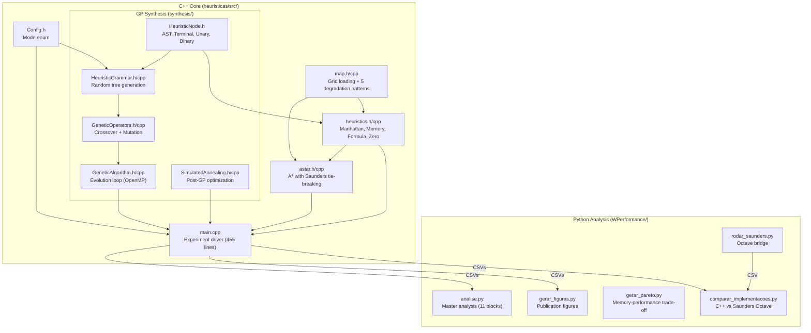
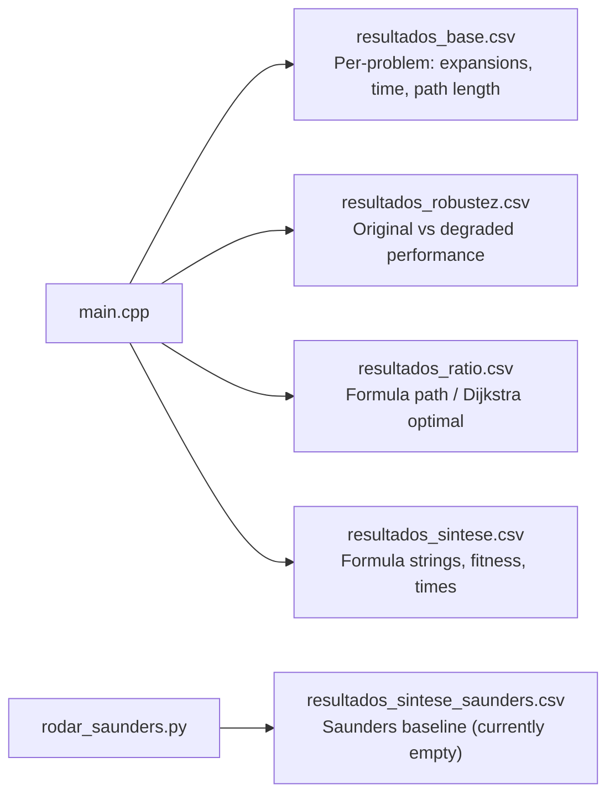

# Heurística Project — Full Walkthrough

## What This Project Is

A **PIBIC (undergraduate research) project** that synthesizes and compares heuristics for **A\* pathfinding on grid maps** from games (Dragon Age Origins). The core research question:

> *Can a Genetic Programming (GP) evolved formula compete with Manhattan distance and memory-expensive Differential heuristics — in both speed and robustness?*

The GP synthesis engine was **translated from Saunders (2024) MATLAB code** into C++17 (see [fsynth-tarball/](file:///home/alejr/Documentos/heuristica/fsynth-tarball) for the original).

---

## The 3 Heuristic Families

| Heuristic | How it works | Memory | Admissible? |
|-----------|-------------|--------|-------------|
| **Manhattan** | `|dx| + |dy|` | Zero | ✅ Always |
| **Formula (GP)** | AST tree evolved by genetic programming | Zero (just the formula) | ⚠️ Depends on mode |
| **Memory (Pivots)** | `max(|d(p,s) - d(p,g)|)` over pre-computed pivot BFS distances | O(pivots × vertices) | ✅ Always |

Memory-based is tested at **4 pivot counts**: 10, 20, 50, 100.

---

## Architecture



---

## Key Source Files

### C++ Core

| File | Lines | Purpose |
|------|-------|---------|
| [Config.h](file:///home/alejr/Documentos/heuristica/heuristicas/src/Config.h) | 6 | `Mode` enum: `ABSOLUTE`, `DELTA`, `ADMISSIBILITY`, `HYBRID` |
| [map.cpp](file:///home/alejr/Documentos/heuristica/heuristicas/src/map.cpp) | 233 | Grid loading (HOG `.map` format), BFS connectivity, **5 degradation functions** |
| [heuristics.cpp](file:///home/alejr/Documentos/heuristica/heuristicas/src/heuristics.cpp) | 180 | All heuristic functions + **farthest-first pivot selection** + BFS distance computation |
| [astar.cpp](file:///home/alejr/Documentos/heuristica/heuristicas/src/astar.cpp) | 82 | A\* search with `std::function<int(pair,pair)>` heuristic parameter |
| [main.cpp](file:///home/alejr/Documentos/heuristica/heuristicas/src/main.cpp) | 455 | **The experiment driver** — synthesis, benchmarking, degradation testing, CSV output |

### GP Synthesis Subsystem (`src/synthesis/`)

| File | Lines | Purpose |
|------|-------|---------|
| [HeuristicNode.h](file:///home/alejr/Documentos/heuristica/heuristicas/src/synthesis/HeuristicNode.h) | 376 | AST node hierarchy (Terminal/Unary/Binary), `evaluate()`, `toString()`, `clone()`, tree navigation |
| [HeuristicGrammar.cpp](file:///home/alejr/Documentos/heuristica/heuristicas/src/synthesis/HeuristicGrammar.cpp) | 80 | Random formula tree generation (mode-dependent terminals) |
| [GeneticAlgorithm.cpp](file:///home/alejr/Documentos/heuristica/heuristicas/src/synthesis/GeneticAlgorithm.cpp) | 95 | Evolution loop: fitness eval (OpenMP parallel), elitism (top 10%), crossover+mutation |
| [GeneticOperators.cpp](file:///home/alejr/Documentos/heuristica/heuristicas/src/synthesis/GeneticOperators.cpp) | 59 | Subtree crossover + subtree mutation |
| [SimulatedAnnealing.cpp](file:///home/alejr/Documentos/heuristica/heuristicas/src/synthesis/SimulatedAnnealing.cpp) | 59 | Post-GP SA optimization (T₀=1.0, cooling=0.95, 100 iterations) |

### Python Analysis Pipeline (`WPerformance/`)

| File | Purpose |
|------|---------|
| [analise.py](file:///home/alejr/Documentos/heuristica/heuristicas/WPerformance/analise.py) | Master analysis — 11 numbered blocks of tables (stdout) |
| [gerar_figuras.py](file:///home/alejr/Documentos/heuristica/heuristicas/WPerformance/gerar_figuras.py) | Publication-ready figures: ratio boxplot, synthesis time bars, degradation curves |
| [gerarGraficos.py](file:///home/alejr/Documentos/heuristica/heuristicas/WPerformance/gerarGraficos.py) | Degradation figure with corrected methodology (intersection filter) |
| [gerar_graficos_sbc.py](file:///home/alejr/Documentos/heuristica/heuristicas/WPerformance/gerar_graficos_sbc.py) | SBC/IEEE conference figures |
| [gerar_pareto.py](file:///home/alejr/Documentos/heuristica/heuristicas/WPerformance/gerar_pareto.py) | Pareto frontier: memory vs expansions trade-off |
| [comparar_implementacoes.py](file:///home/alejr/Documentos/heuristica/heuristicas/WPerformance/comparar_implementacoes.py) | Side-by-side C++ vs Saunders Octave comparison |
| [rodar_saunders.py](file:///home/alejr/Documentos/heuristica/heuristicas/WPerformance/rodar_saunders.py) | Runs original Saunders MATLAB via Octave subprocess |
| [visualize_degradations.py](file:///home/alejr/Documentos/heuristica/heuristicas/WPerformance/visualize_degradations.py) | Generates PPM images of degradation patterns |

---

## Experiment Design

### Parameters
- **17 maps**: Dragon Age Origins benchmarks (arena, brc\*, den\*, hrt201n, lak506d)
- **5 seeds**: 42, 123, 456, 789, 1011
- **GP**: Population=80, Generations=100 (20 for ADMISSIBILITY), tree size 5-20
- **SA**: 100 iterations, T₀=1.0, cooling=0.95 (only used if it improves fitness)
- **Training set**: Stratified sample of min(150, scenarios/4) problems per map
- **Fitness**: `speedup = Σ expansions_manhattan / Σ expansions_formula - λ·tree_size`

### 4 Synthesis Modes
| Mode | Terminals Available | Goal |
|------|-------------------|------|
| `ABSOLUTE` | x₁, y₁, x₂, y₂ | Raw coordinates |
| `DELTA` | Δx, Δy | Relative distances (more generalizable) |
| `ADMISSIBILITY` | Δx, Δy + penalty for overestimation | Never overestimate optimal cost |
| `HYBRID` | Δx, Δy + pivot_dist_s, pivot_dist_g (3 pivots) | Formula + minimal memory |

### 5 Degradation Patterns (Robustness Testing)
| Pattern | Method | Tested at |
|---------|--------|-----------|
| Radial | Elliptical obstacle clusters | 10%, 20%, 30% blocking |
| Linear | Wall segment obstacles | 10%, 20%, 30% blocking |
| Sparse | Probabilistic radial patches | 10%, 20%, 30% blocking |
| Organic | Random-walk blocking | 10%, 20%, 30% blocking |
| Stochastic | Individual random cells (Saunders' method) | 10%, 20%, 30% blocking |

### Output CSVs



---

## Data Flow (End to End)

```
┌─────────────────────────────────────────────────────────┐
│  C++ Pathfinding Engine (main.cpp)                       │
│                                                          │
│  For each map × seed × mode:                            │
│    1. Load map + scenarios                               │
│    2. GP synthesis (80 pop × 100 gen) + SA               │
│    3. Benchmark: Manhattan vs Formula vs Memory(10-100)  │
│    4. Ratio: Formula path ÷ Dijkstra optimal             │
│    5. Robustness: 5 degradations × 3 block levels        │
│                                                          │
│  → 4 CSV files                                           │
└───────────────┬─────────────────────────────────────────┘
                │
                ▼
┌─────────────────────────────────────────────────────────┐
│  Python Analysis Pipeline (WPerformance/)                │
│                                                          │
│  analise.py        → Text tables (11 blocks)             │
│  gerar_figuras.py  → img/fig[1-3]_*.pdf                  │
│  gerarGraficos.py  → figura1_degradacao_v3.pdf           │
│  gerar_pareto.py   → pareto_heuristicas.pdf              │
│  comparar_impl.py  → C++ vs Saunders comparison table    │
└─────────────────────────────────────────────────────────┘
```

---

## Notable Design Decisions

1. **Global mutable state** — `grid`, `height`, `width`, `pivos`, `distPivos`, `currentFormula` are all globals (typical for research code)
2. **Saunders tie-breaking** in A\* — when f-values are equal, prefer higher g-value (closer to goal)
3. **SA safeguard** — Simulated Annealing result is only accepted if fitness ≥ GA result
4. **HYBRID mode uses only 3 pivots** for formula terminals (hardcoded)
5. **Protected division** in AST — `DIV` returns 0 when denominator = 0
6. **Formula fallback** — if formula evaluation fails, falls back to `75 * max(dx, dy)`
7. **Two-step seed aggregation** in Python — first average per seed (collapse instances), then mean ± std across seeds

## Current State

> [!NOTE]
> - All spec tasks (003 and 005) are marked **complete** ✅
> - `resultados_sintese_saunders.csv` is **header-only** (Saunders baseline not yet generated)
> - The `results.db` SQLite database (89MB) exists in WPerformance/
> - The compiled binary `pathfinding` (178KB) exists
